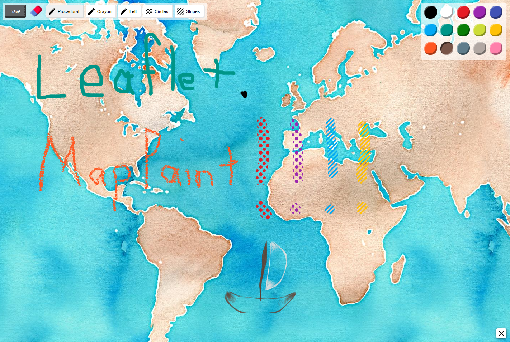

Leaflet.MapPaint
================



Bitmap painting for [Leaflet](http://leafletjs.com).

 * Designed for touch device
  * Works fine with an old mouse
 * 15 different colors!
 * Felt, crayon, procedural pencil and fancy/ugly patterns

__[Demo](http://sintef-9012.github.io/Leaflet.MapPaint/)__

### Requirements

 * Tested with Leaflet 0.7
 * A HTML5 browser supporting canvas is required
  * Tested with Safari iOS8, Firefox 33, Chrome 38 and Internet Explorer 11

### Installation

[Download the archive](https://github.com/SINTEF-9012/MapPaint/archive/master.zip) or use bower :

```
bower install leaflet-mappaint
```

You need to include the JavaScript file and the CSS file. Feel free to improve the CSS file.

### Usage

```javascript
leafletMap.MapPaint.enable();
...
leafletMap.MapPaint.disable();
```

You can also use the control switch :
```javascript
leafletMap.addControl(new MapPaint.SwitchControl());
```

### Saving

By default the drawing is added to the map as a [L.ImageOverlay](http://leafletjs.com/reference.html#imageoverlay). You can setup a different save method :

```javascript
leafletMap.MapPaint.saveMethod = function(image, bounds) {
}
```
__image__ is a PNG file as a base64 string

Example: `"data:image/png;base64,iVBORw0KGgoAAAANSUhEUgAAAsMAAAIHCAYAAAB69VHgAAAgAElEQ…Gmc9yN5Rv"`

__bounds__ represents the [L.LatLngBounds](http://leafletjs.com/reference.html#latlngbounds) of the drawing.

### Acknowledgements

This library is developed in context of the [BRIDGE](http://www.bridgeproject.eu/en) project.

The icons are from the [material design icons](https://github.com/google/material-design-icons) project.

### Licence

The source code of this library is licenced under the MIT License.
